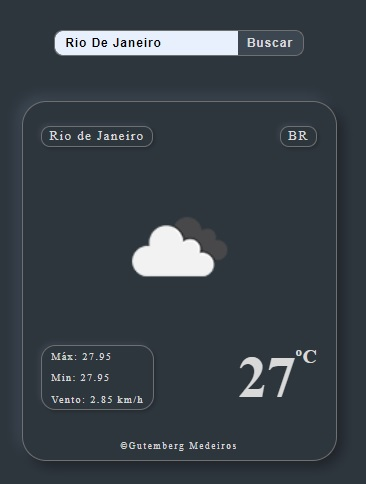

# 🎫 Página inicial

<h1 align="center">

</h1>

# 📋 Indice

- Sobre
- Tecnologias Utilizadas

# 📜 Sobre

- O API Temp é um projeto que foi criado para estudos de algumas funções e propriedades do JavaScript pra fins didáticos afim de entender como funciona o consumo de uma API clima javascript puro.
Utilizei o fetch API, uma ferramenta para requisições HTTP assíncronas, que devolve uma Promise e foi utilizado as declarações async e await..

## 🚀 Tecnologias Utilizadas

- [Html](https://developer.mozilla.org/pt-BR/docs/Web/HTML)
- [Css](https://developer.mozilla.org/pt-BR/docs/Web/CSS)
- [JavaScript](https://developer.mozilla.org/pt-BR/docs/Web/JavaScript)